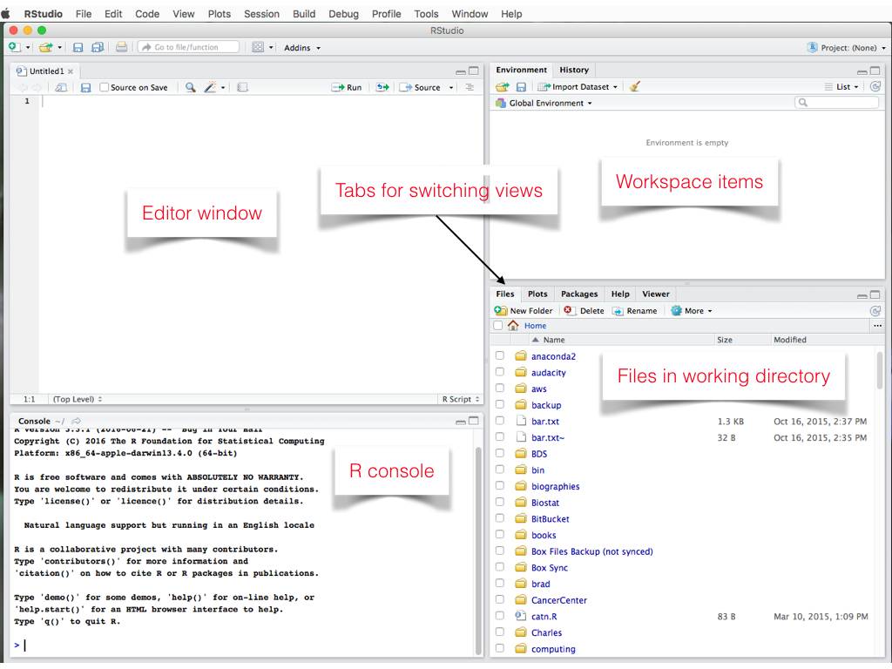

```{r}
#| include: false
library(tidyverse)
library(wooldridge)
```


## Informazioni {.center}

- **Materiale:** disponibile su [GitHub](https://andrerecio.github.io/econometria-triennale/) e Moodle
- **Orari:** Calendario su Moodle e sito di Facoltà — eventuali variazioni saranno comunicate su Moodle
- **Contatto:** [andrea.recine@uniroma1.it](mailto:andrea.recine@uniroma1.it)

---

## Cosa faremo?

Imparare a **interpretare i risultati delle regressioni**

- L'output delle regressioni è parte importante della prova scritta
- La prova orale richiede una buona comprensione teorica

---

## Cosa potete fare?

Sfruttare le esercitazioni per imparare a usare R, manipolare i dati, costruire grafici e interpretare i risultati

> *"Data scientists spend 50-80% of their time collecting and preparing data, before it can be explored for useful nuggets."* — [NYT, 2014](https://www.nytimes.com/2014/08/18/technology/for-big-data-scientists-hurdle-to-insights-is-janitor-work.html)


Oggi con LLMs cosa cambia?

Divertitevi a sperimentare con il codice


---


## Programmazione

Linguaggi di programmazione:

- più diffusi open source: R, Python e Julia
- più diffusi commerciali: Stata e Matlab


Python è sempre più richiesto nel mercato del lavoro. R ha una comunità molto attiva in ambito accademico (e molti pacchetti per l'econometria)

---

## R

Tutto il materiale è scritto in **R**:

- [R](https://cran.r-project.org/) — linguaggio di programmazione
- [RStudio](https://posit.co/download/rstudio-desktop/) — è un ambiente di sviluppo integrato (IDE) 

Potete usare anche altri IDE come [VSCode](https://code.visualstudio.com/)

I materiali e le slide sono prodotti con [Quarto](https://quarto.org/)

---


## Installare R e RStudio

- Scaricate R da [CRAN](https://cran.r-project.org/)
- Scaricate RStudio da [RStudio](https://posit.co/download/rstudio-desktop/)
- Seguite le istruzioni di installazione per il vostro sistema operativo

---

## Struttura delle esercitazioni {.center}

Ogni esercitazione è composta da:

- File **HTML** — materiale di riferimento con codice e spiegazioni
- **Script `.R`** — codice che potete eseguire (**run!**) se volete esercitarvi


Su [GitHub](https://andrerecio.github.io/econometria-triennale/) trovate entrambi i file: HTML e script R.


---

## 📖 Le esercitazioni {.center}

Le spiegazioni nei file **HTML** possono aiutarvi a capire meglio i risultati delle regressioni, ma per superare l'esame dovete anche studiare la teoria 


## RStudio layout

{fig-align="center" width=80%}

---

## 📝 Task 1

- Aprire un nuovo script: `File > New File > R Script`
- Eseguite il seguente codice (Ctrl + Invio o Cmd + Invio o Run)

```{r}
#| output-location: column
x <- 1:10
y <- x^2 
plot(x, y)
```


- Potete scaricare lo script completo qui: [Script R](intro/intro.R)

---


## 📦 Pacchetti R

- Installare e caricare i pacchetti necessari:

```{r}
#| eval: false
install.packages("tidyverse")
install.packages("wooldridge")
library(tidyverse)
library(wooldridge)
```

- Non è necessario installare i pacchetti ogni volta, basta caricarli con `library()`

---


## 🌐 Tidyverse

`tidyverse` è una raccolta di pacchetti R per analisi dei dati:

- `dplyr` — manipolare i dati
- `ggplot2` — grafici
- `tidyr` — riorganizzare i dati
- `readr` — importare CSV e altri file

::: {.callout-tip}
Potete caricare i pacchetti singolarmente: `library(ggplot2)`, `library(dplyr)` oppure tutti insieme con `library(tidyverse)`
:::


## 🗂️ Dataset

- I dataset in R sono organizzati in **dataframe** (tabelle con righe e colonne)

- `library(tidyverse)` usa il formato tibble, una versione migliorata di dataframe


---


## 🗂️ Dataset: `wage1` 
```{r}
data("wage1", package = "wooldridge")
str(wage1)
```

---


## 🧹 Tidying — manipolare i dati: `dplyr`


1. `filter()`: seleziona osservazioni in base a una condizione
2. `arrange()`: riordina le righe
3. `select()`: seleziona variabili per nome
4. `mutate()`: crea nuove variabili a partire da quelle esistenti
5. `summarise()`: riduce i dati a un unico riepilogo
6. `group_by()`: applica le funzioni precedenti a gruppi anziché all'intero dataset


---


## 🧹 Tidying — manipolare i dati

Creiamo un nuovo dataset: solo chi ha più di 12 anni di istruzione:

```{r}
wage_educ_higher <- wage1 |>
                   filter(educ > 12)
head(wage_educ_higher)                   

```


- `|>` o `%>%` è l'operatore **pipe**: passa l'output di un'espressione come input della funzione successiva, concatenando più operazioni

---


## 📊 Summarising — statistiche descrittive

```{r}
wage1 |>
  summarise(
    wage_mean   = mean(wage),
    wage_median = median(wage),
    wage_sd     = sd(wage),
    educ_mean   = mean(educ)
  )
```

---

## 📊 Summarising — per gruppi

`group_by()` calcola le statistiche separatamente per ogni gruppo:

```{r}
wage1 |>
  group_by(female) |>
  summarise(
    wage_mean = mean(wage),
    wage_sd   = sd(wage),
    n         = n()
  )
```

- `female = 0` → uomini, `female = 1` → donne
- `n()` conta le osservazioni per gruppo

---

## 📈 Visualising — distribuzione

- ggplot2 è un pacchetto per creare grafici personalizzati basato sulla grammatica dei grafici (_gg_)

```{r}
#| output-location: slide
ggplot(wage1, aes(x = wage)) +
  geom_histogram(fill = "lightblue", color = "black", bins = 20) +
  labs(title = "Distribuzione del salario orario",
       x = "Salario orario (dollari)", y = "Frequenza") +
  theme_minimal()
```

---


## 🚔 Data: polizia e crimine

```{r}
url_data <- "https://raw.githubusercontent.com/andrerecio/econometria-triennale/main/intro/crime2_clean.csv"

crime <- read_csv(url_data, show_col_types = FALSE, na = ".")
glimpse(crime)
```

- [Codebook](https://github.com/andrerecio/econometria-triennale/blob/main/intro/codebook_crime2.md) con le variabili


## 👮 Polizia e crimine


- Creiamo due nuove variabili: `violent` (crimini violenti per 100.000 abitanti) e `police` (poliziotti per 100.000 abitanti) per alcuni anni

- Visualizziamo la relazione tra polizia e crimine violento

```{r}
#| output-location: slide
crime_sub <- crime |>
  filter(year %in% c(1985, 1987, 1989, 1991)) |>
  mutate(
    violent = (murder + rape + robbery + assault) / citypop * 100000,
    police  = sworn / citypop * 100000
  )

ggplot(crime_sub, aes(x = police, y = violent)) +
  geom_point(alpha = 0.75) +
  labs(
    x = "Poliziotti per 100.000 abitanti",
    y = "Crimini violenti per 100.000 abitanti"
  ) +
  theme_minimal(base_size = 20)
```


##  🔍 Polizia e crimine

- La figura mostra una correlazione **positiva** tra polizia e crimine: più polizia, più crimine?

- In realtà, le città con più crimine assumono più poliziotti — è il crimine a causare più polizia, non il contrario


## Letture utili


- [R for Data Science](https://r4ds.had.co.nz/transform.html) 
- [ModernDive](https://moderndive.com/1-getting-started.html)

---


